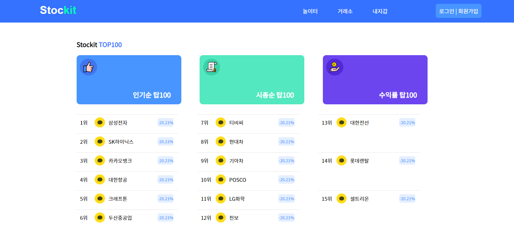
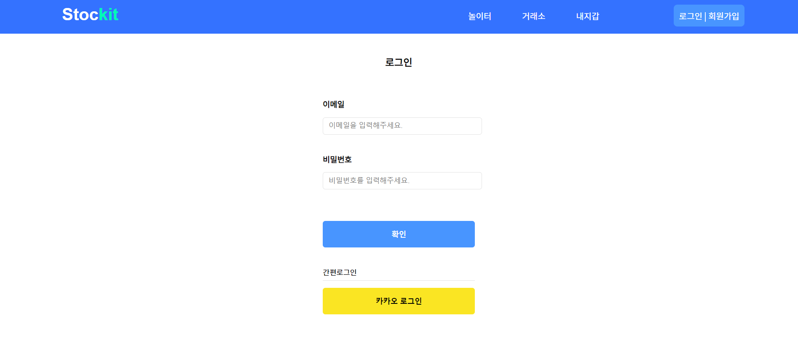
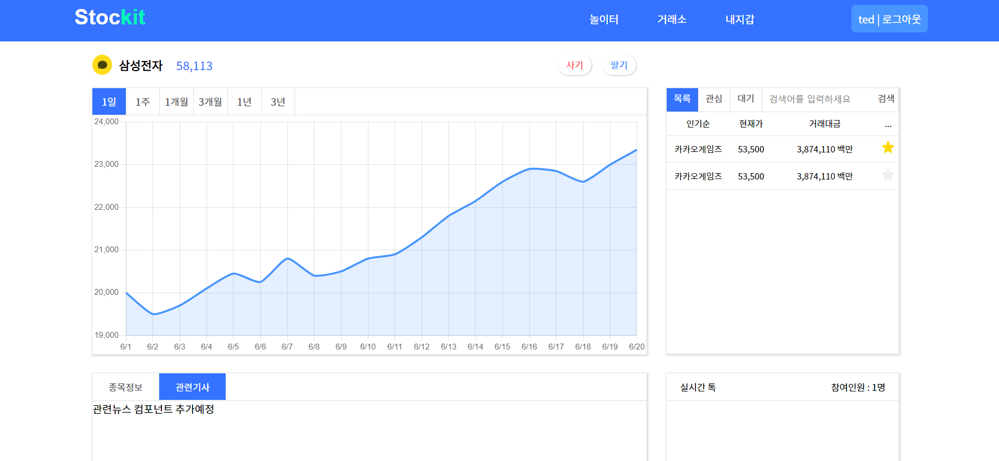
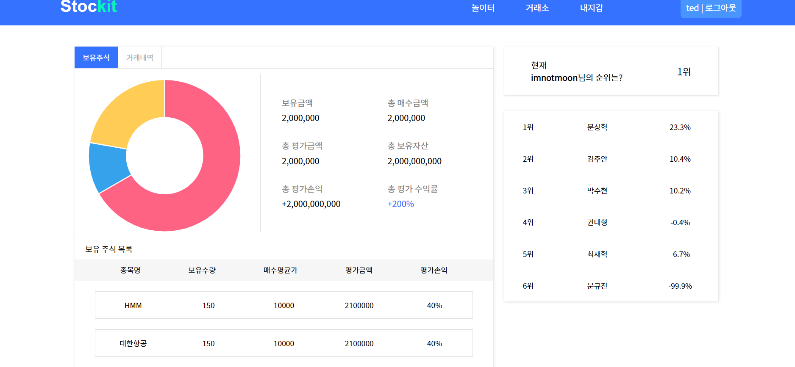
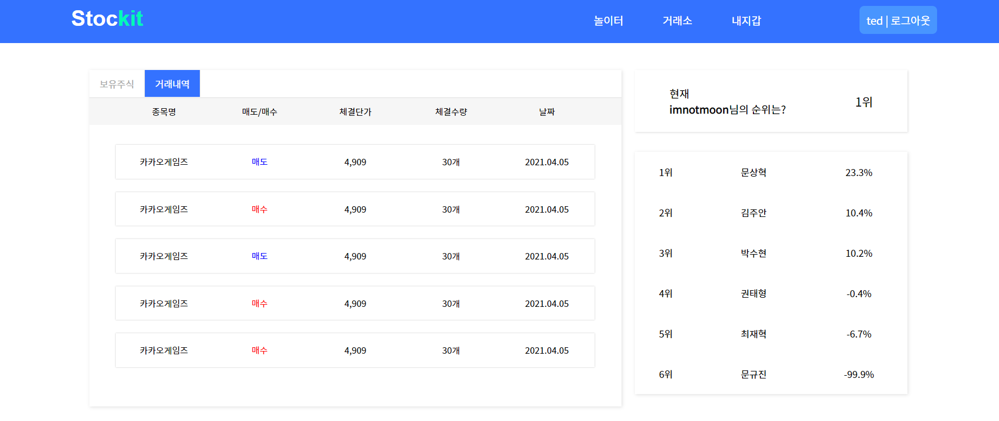

# STOCKIT-BACKEND
한이음 프로젝트 '주린이를 위한 모의투자 플랫폼'

## Motivation / Introduction
2021년 미래창조과학부 ICT 인재 양성사업의 일환으로 진행하는 ICT 멘토링을 받으며 프로젝트를 진행하게 되었습니다.

'*Stockit*'은 '주식 입문자들을 위한 모의투자 플랫폼'입니다.  
쉬운 UI를 통해 주식 입문자들이 실제 주식시장에 들어가기 전 연습을 할 수 있도록 도와주는 프로젝트입니다.

## How to use
(개발중)  
### 메인 페이지

### 로그인 페이지

### 종목 상세 페이지

### 나의 계좌정보 페이지

### 나의 주문내역 페이지

## Tech used  
* language : Java, TypeScript
* framework : Spring, React
* tool : Intellij, Visual Code
* database : MariaDB
